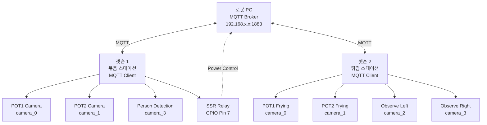
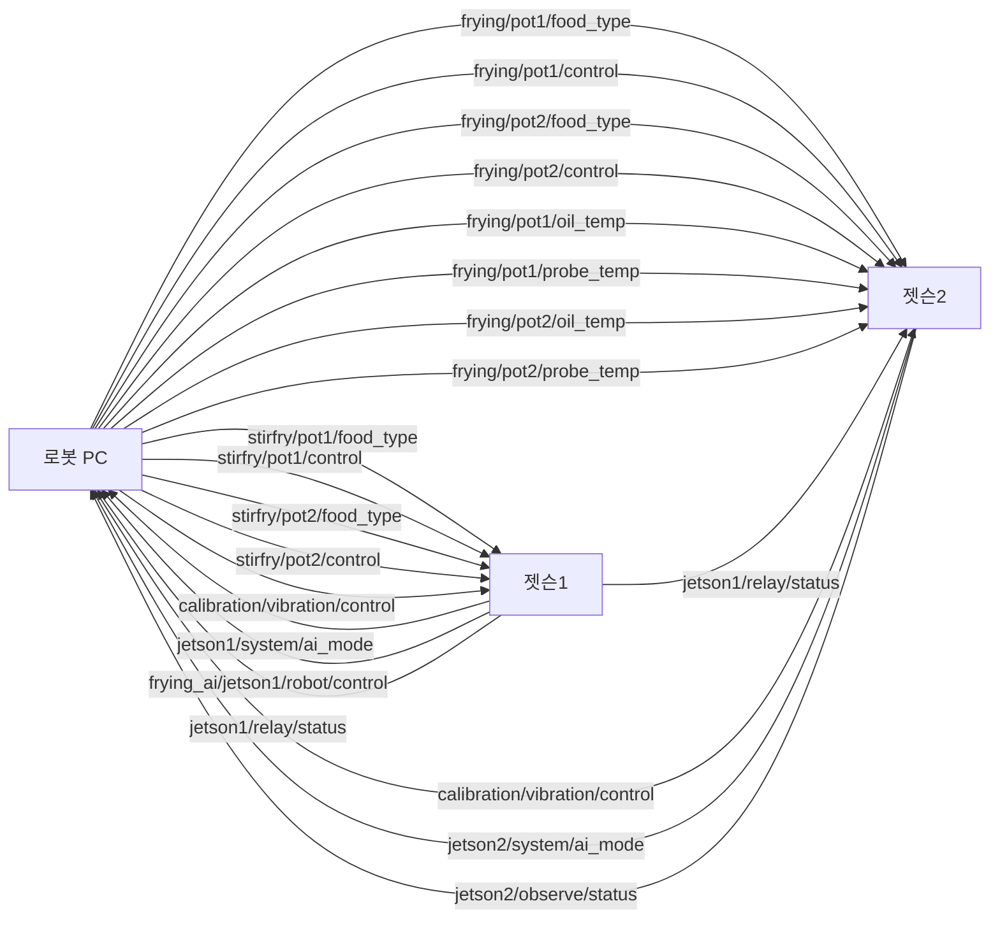
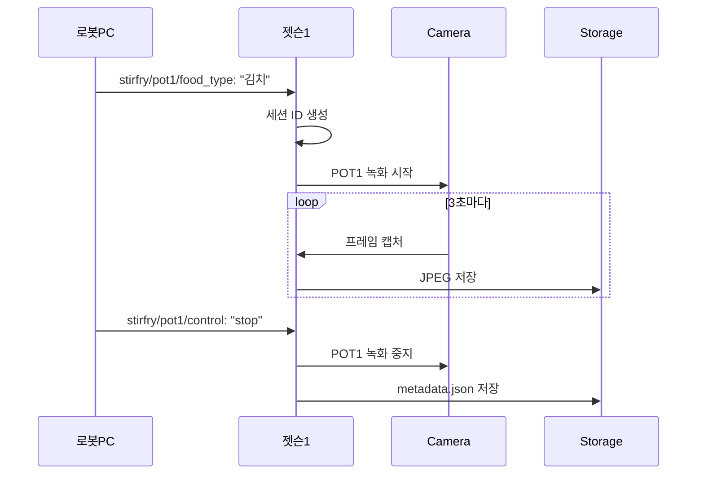
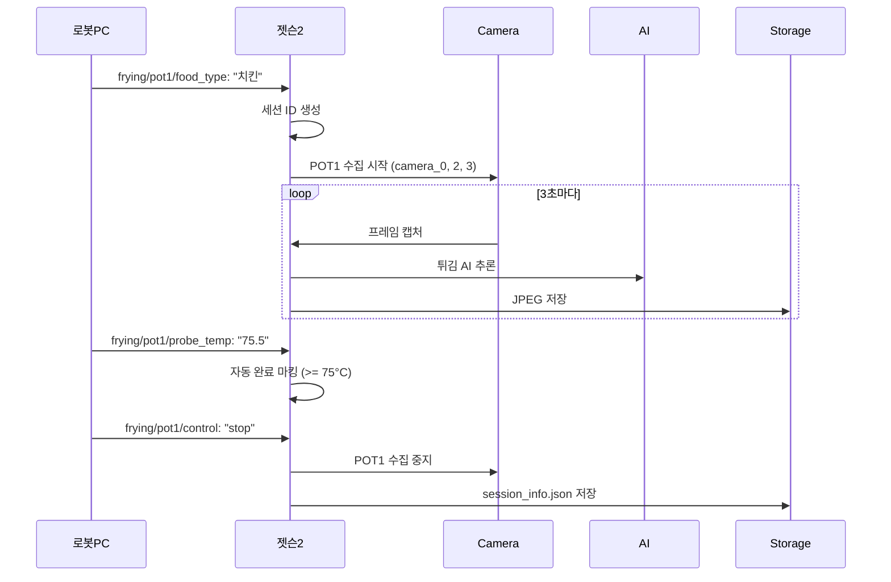

# 시스템 아키텍처 개요

**버전**: 2.0 (POT1/POT2 분리)
**최종 업데이트**: 2025-11-24

---

## 시스템 구성

### 전체 시스템 다이어그램



---

## 장치 상세

### 로봇 PC

**역할**: MQTT 브로커, 시스템 제어

**사양**:
- OS: Windows/Linux
- MQTT Broker: mosquitto
- 포트: 1883 (MQTT)

**기능**:
- MQTT 메시지 라우팅
- 젯슨에게 조리 명령 전송
- 젯슨으로부터 상태 수신
- 온도 센서 데이터 전송 (젯슨2)

---

### 젯슨 1 (볶음 스테이션)

**역할**: 볶음 모니터링 + 사람 감지

**하드웨어**:
- Jetson Orin Nano
- GMSL 카메라 3대
  - camera_0: POT1 (왼쪽 볶음솥)
  - camera_1: POT2 (오른쪽 볶음솥)
  - camera_3: 사람 감지
- GPIO Pin 7: SSR 릴레이 제어

**소프트웨어**:
- JETSON1_INTEGRATED.py
- YOLO 사람 감지
- MQTT Client (paho-mqtt)

**데이터 저장**:
```
~/AI_Data/StirFryData/
├── pot1/
│   └── session_ID/
│       └── food_type/
│           ├── camera_0/
│           │   └── *.jpg
│           └── metadata.json
└── pot2/
    └── session_ID/
        └── food_type/
            ├── camera_1/
            │   └── *.jpg
            └── metadata.json
```

---

### 젯슨 2 (튀김 스테이션)

**역할**: 튀김 AI + 바구니 감지

**하드웨어**:
- Jetson Orin Nano
- GMSL 카메라 4대
  - camera_0: POT1 튀김 왼쪽
  - camera_1: POT2 튀김 오른쪽
  - camera_2: 관찰 왼쪽 (공유)
  - camera_3: 관찰 오른쪽 (공유)

**소프트웨어**:
- JETSON2_INTEGRATED.py
- 튀김 AI (segmentation + classification)
- 바구니 AI (basket detection)
- MQTT Client (paho-mqtt)

**데이터 저장**:
```
~/AI_Data/FryingData/
├── pot1/
│   └── session_ID/
│       └── food_type/
│           ├── camera_0/  (POT1 전용)
│           ├── camera_2/  (공유)
│           ├── camera_3/  (공유)
│           └── session_info.json
└── pot2/
    └── session_ID/
        └── food_type/
            ├── camera_1/  (POT2 전용)
            ├── camera_2/  (공유)
            ├── camera_3/  (공유)
            └── session_info.json
```

**특징**: 관찰 카메라(2, 3)는 POT1 또는 POT2 중 하나라도 활성화되면 공유됨

---

## MQTT 통신 구조

### 토픽 구조



---

## 데이터 흐름

### 젯슨1 데이터 흐름



---

### 젯슨2 데이터 흐름



---

## 주요 특징

### 1. POT1/POT2 독립 제어

**각 솥은 완전히 독립적**:
- 별도의 세션 ID
- 별도의 메타데이터
- 동시 작동 가능
- 간섭 없음

**예시**:
```
POT1: 김치볶음 (14:00 ~ 14:10)
POT2: 야채볶음 (14:05 ~ 14:15)
```

두 솥이 5분간 동시 작동, 각각 독립적으로 데이터 저장

---

### 2. 자동 시작/중지

**자동 시작**:
- 음식 종류 메시지 수신 → 즉시 녹화/수집 시작
- GUI 버튼 클릭 불필요
- 로봇 PC에서 완전 제어

**자동 중지**:
- stop 메시지 수신 → 즉시 녹화/수집 중지
- 메타데이터 자동 저장
- 젯슨2는 탐침 온도 75°C 도달 시 자동 완료 마킹

---

### 3. 관찰 카메라 공유 (젯슨2)

**camera_2, camera_3는 POT1과 POT2가 공유**:
- POT1 활성화 → camera_0, 2, 3 저장 (POT1 폴더)
- POT2 활성화 → camera_1, 2, 3 저장 (POT2 폴더)
- 동시 활성화 → 양쪽 모두 camera_2, 3 저장

**이유**: 바구니 감지는 양쪽 튀김솥 모두 모니터링 필요

---

### 4. 사람 감지 및 릴레이 제어 (젯슨1)

**주간 모드** (07:30 - 19:30):
1. 사람 감지 (2초 유지)
2. GPIO Pin 7 HIGH → SSR 릴레이 ON
3. 로봇 PC 전원 켜짐
4. MQTT: `frying_ai/jetson1/robot/control` "ON" 발행
5. 야간 모드까지 계속 ON 유지

**야간 모드** (19:30 - 07:30):
1. 10분간 사람 미감지
2. GPIO Pin 7 LOW → SSR 릴레이 OFF
3. 로봇 PC 전원 꺼짐
4. MQTT: `frying_ai/jetson1/robot/control` "OFF" 발행

---

### 5. 온도 기반 자동 완료 (젯슨2)

**탐침 온도 >= 75.0°C 도달 시**:
- 자동으로 completion_marked: true
- completion_info에 상세 정보 저장:
  - 완료 시점 타임스탬프
  - 탐침 온도
  - 기름 온도
  - 경과 시간

**메타데이터 예시**:
```json
{
  "completion_marked": true,
  "completion_info": {
    "method": "auto (probe_temp >= 75.0°C)",
    "timestamp": "2025-11-24 14:34:15",
    "probe_temp": 75.5,
    "oil_temp": 180.0,
    "elapsed_time_sec": 203.2
  }
}
```

---

## 네트워크 요구사항

### 대역폭

**젯슨1**:
- MQTT: 최소 (< 1 KB/s)
- 카메라 스트리밍: 없음 (로컬 저장만)

**젯슨2**:
- MQTT: 최소 (< 1 KB/s)
- 카메라 스트리밍: 없음 (로컬 저장만)

**총합**: < 10 KB/s (MQTT만 사용)

---

### 레이턴시

**MQTT 메시지 전송**:
- 목표: < 100ms
- 일반적: 10-50ms (LAN 환경)

**자동 시작 지연**:
- 메시지 수신 → 녹화 시작: < 100ms

---

### 안정성

**QoS 1 (최소 1회 전달)**:
- 네트워크 불안정 시에도 메시지 전달 보장
- 중복 메시지 가능 (젯슨에서 처리)

**Keep-Alive 60초**:
- 연결 상태 주기적 확인
- 연결 끊김 시 자동 재연결

---

## 확장성

### 추가 젯슨 장치

새로운 젯슨 추가 시:
1. 고유한 Client ID 부여
2. 고유한 토픽 사용
3. MQTT Broker에 연결

**예시**: 젯슨3 (디저트 스테이션) 추가
- Client ID: `jetson3_ai`
- 토픽: `dessert/pot1/food_type`, `dessert/pot1/control` 등

---

### 추가 POT

현재 시스템은 POT1, POT2 지원. POT3 추가 시:
1. 토픽 추가: `stirfry/pot3/food_type`, `stirfry/pot3/control`
2. 카메라 추가: camera_2 (POT3용)
3. 코드 수정: POT3 처리 로직 추가

---

## 보안 고려사항

### 현재 보안 수준

**인증**: 없음 (localhost 또는 LAN 내부)

**암호화**: 없음 (MQTT over TCP, 비암호화)

**접근 제어**: IP 기반 (같은 네트워크만 접근)

---

### 보안 강화 방안 (필요 시)

**1. TLS 암호화**:
```json
{
  "mqtt_port": 8883,
  "mqtt_use_tls": true,
  "mqtt_ca_certs": "/path/to/ca.crt"
}
```

**2. 사용자 인증**:
```json
{
  "mqtt_username": "jetson1",
  "mqtt_password": "secure_password"
}
```

**3. 방화벽 설정**:
```bash
sudo ufw allow from 192.168.0.0/24 to any port 1883
```

---

## 성능 지표

### 젯슨1

| 항목 | 값 |
|------|-----|
| 프레임 스킵 | 90 (3초마다 1장, 30fps) |
| JPEG 품질 | 100 |
| 이미지 크기 | ~800 KB/장 |
| 5분 조리 | ~100장 = ~80 MB |
| 일일 예상 (10세션) | ~800 MB |

---

### 젯슨2

| 항목 | 값 |
|------|-----|
| 수집 간격 | 3초 |
| JPEG 품질 | 100 |
| 이미지 크기 | ~800 KB/장 |
| 카메라 수 | 3대 (POT1 또는 POT2 활성화 시) |
| 5분 조리 | ~300장 = ~240 MB |
| 일일 예상 (10세션) | ~2.4 GB |

---

**버전**: 2.0
**최종 업데이트**: 2025-11-24
